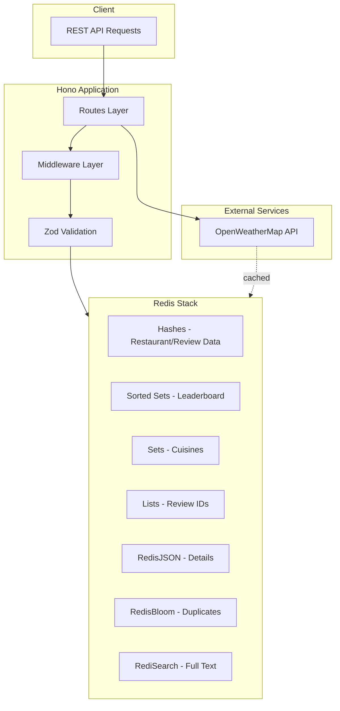

# Bites & Ratings API

[](https://redis.io/)
[](https://bun.sh/)
[](https://www.typescriptlang.org/)
[](https://hono.dev/)
[](https://www.better-auth.com/)
[](https://www.docker.com/)

A high-performance RESTful API for restaurant management and review processing, built with Redis Stack as a multi-model primary database. This project demonstrates some advanced data structures, sophisticated cache invalidation strategies, and real-time rating calculations.

---

## Table of Contents

- [Motivation](#motivation)
- [Architecture](#architecture)
- [Key Features](#key-features)
- [Technology Stack](#technology-stack)
- [Getting Started](#getting-started)
- [API Reference](#api-reference)
- [License](#license)

---

## Motivation 

I decided to create this project to bridge the gap between theoretical university modules I have attended on data management and practical system engineering. Having developed a strong interest in caching mechanisms and process optimization during my studies, I built this API to explore and deepen my knowledge about:

- **Cache Invalidation Patterns:** Implementing both time-based (TTL) and event-based invalidation to solve the "stale data" problem.
- **Probabilistic Data Structures:** Utilizing Bloom filters to optimize memory usage and prevent unnecessary database lookups.
- **Data Dependency Management:** Handling cascading updates across multiple Redis data types (e.g. Hashes, Sets, Lists, and Sorted Sets) to maintain strict data consistency.

---

## Architecture

The project treats Redis as a primary multi-model database rather than a simple key-value store, leveraging multiple Redis modules and data structures:



### Redis Module Usage

| Module | Purpose |
|--------|---------|
| **RediSearch** | Full-text indexing of `name` field with sortable `avgStars` |
| **RedisBloom** | Duplicate prevention during restaurant creation (~0.01% error rate) |
| **RedisJSON** | Atomic updates for nested restaurant details (links, contacts) |
| **Sorted Sets** | Restaurant leaderboard with O(log N) ranking updates |
| **Hashes** | Primary storage for restaurant and review entities |
| **Sets** | Cuisine categorization and restaurant-cuisine relationships |
| **Lists** | Ordered review IDs per restaurant for pagination |

---

## Key Features

- **Bloom Filter Duplicate Prevention** - Prevents duplicate restaurant entries using probabilistic membership testing with configurable error rate
- **Full-Text Search** - Search restaurants by name using RediSearch indexing
- **Real-Time Rating Recalculation** - Atomic average rating updates with automatic leaderboard synchronization
- **Dual Cache Invalidation** - Weather data cached with 1-hour TTL + event-based invalidation on location change
- **View Count Tracking** - Automatic increment of restaurant view counts
- **Pagination Support** - Configurable page/limit parameters for restaurants and reviews
- **Cuisine Categorization** - Tag restaurants with cuisines and query by cuisine type

---

## Technology Stack

| Category | Technology |
|----------|------------|
| **Runtime** | Bun |
| **Framework** | Hono |
| **Database** | Redis Stack (RediSearch, RedisJSON, RedisBloom) |
| **Validation** | Zod |
| **Infrastructure** | Docker & Docker Compose |
| **Language** | TypeScript |

> **Why?** Because I like performance. Bun provides a significantly faster runtime with built-in TypeScript support than a traditional Node.js. Coupled with Hono the API has almost zero overhead, making it ideal for low-latency applications. I also used Zod for schema validation, ensuring Redis data remains consistent and type-safe.

> **Why Redis as a primary database?** I know normally it is used as a cache sitting in front of a disk-based database (e.g. PostgreSQL). By using Redis Stack as the primary store, I eliminate the hop between the cache and the database, drastically reducing response time. And the specialized modules (like RedisJSON or RediSearch) allow for complex data modeling without sacrificing the speed of in-memory storage.

---

## Getting Started

### Prerequisites

- Docker & Docker Compose
- Bun Runtime
- OpenWeatherMap API Key (for weather feature)

### Installation & Setup

1. **Clone the repository:**

```bash
git clone https://github.com/Pr1ncep5/bites-ratings-api.git
cd bites-ratings-api
```

2. **Configure environment variables:**

```bash
cp .env.example .env
# Edit .env and add your WEATHER_API_KEY
```

3. **Spin up infrastructure:**

```bash
docker compose up -d
```

4. **Install dependencies:**

```bash
bun install
```

5. **Initialize database structures:**

This command sets up the RediSearch index and reserves memory for the Bloom filter:

```bash
bun run setup
```

6. **Run the application:**

```bash
bun run dev
```

The API will be available at `http://localhost:3000`. RedisInsight UI is accessible at `http://localhost:8001`.

---

## API Reference

### Restaurants

| Method | Endpoint | Description |
|--------|----------|-------------|
| `GET` | `/restaurants` | List all restaurants (paginated, sorted by rating) |
| `POST` | `/restaurants` | Create a new restaurant (Bloom filter protected) |
| `GET` | `/restaurants/search?q={query}` | Full-text search by name |
| `GET` | `/restaurants/:id` | Get restaurant by ID (increments view count) |
| `PUT` | `/restaurants/:id` | Update restaurant (invalidates weather cache if location changes) |

### Restaurant Details

| Method | Endpoint | Description |
|--------|----------|-------------|
| `POST` | `/restaurants/:id/details` | Add nested details (links, contacts) |
| `GET` | `/restaurants/:id/details` | Get restaurant details |
| `PUT` | `/restaurants/:id/details` | Update restaurant details |

### Reviews

| Method | Endpoint | Description |
|--------|----------|-------------|
| `POST` | `/restaurants/:id/reviews` | Add a review (recalculates average rating) |
| `GET` | `/restaurants/:id/reviews` | List reviews (paginated) |
| `PUT` | `/restaurants/:id/reviews/:reviewId` | Update a review (recalculates rating) |
| `DELETE` | `/restaurants/:id/reviews/:reviewId` | Delete a review |

### Weather

| Method | Endpoint | Description |
|--------|----------|-------------|
| `GET` | `/restaurants/:id/weather` | Get cached weather for restaurant location |

### Cuisines

| Method | Endpoint | Description |
|--------|----------|-------------|
| `GET` | `/cuisines` | List all cuisines |
| `GET` | `/cuisines/:cuisine` | List restaurants by cuisine |

---

## License

This project is licensed under the MIT License - [LICENSE](LICENSE).
